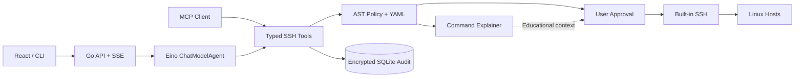

# OpsPilot — AI SSH 运维 Agent

OpsPilot 是一个使用 Go 与 Eino 构建的 AI 运维 Agent：LLM 通过受控工具完成 SSH 诊断、部署和恢复，而风险分级、人工审批、加密审计和输出脱敏全部由服务端强制执行——模型只能提出操作，批准与执行始终在你手里。

## 特性

- **受控执行**：命令由确定性策略分级，变更需人工审批，危险操作逐次确认并填写原因，禁止项永久拒绝。
- **内置跨平台 SSH**：支持 `ssh-agent`、上传私钥、密码、SOCKS5/HTTP 代理、ProxyJump 链、托管 sudo 和严格 Host Key 校验，不依赖系统 `ssh` 命令。
- **多模型**：任意 OpenAI 兼容提供商，共享代理配置、连接测试、运行时热切换；支持向视觉模型发送图片。
- **Workspace**：托管目录内的文件管理、补丁编辑和 Shell；Linux 可用 Bubblewrap 沙箱，宿主机 Shell 必须逐次审批。
- **可恢复会话**：会话、工具结果、任务计划和审批状态持久化，刷新页面不会中断正在运行的 Agent。
- **加密审计**：命令、输出和凭据使用 AES-256-GCM 加密保存，模型只接收脱敏历史；审计页可检索并结构化展示每次执行。
- **可扩展**：动态加载 Skill 与外部 MCP 工具，自身也可作为 MCP Server 接入其他客户端；内置 Tavily 网络搜索与网页提取。
- **多形态交付**：React 前端嵌入单个 Go 二进制，支持 Docker 部署，Windows 和 Linux 可打包为 Tauri 桌面 App。

## 工作方式



## 快速开始

### 桌面 App（Windows / Linux）

从 [GitHub Releases](https://github.com/Enterpr1se0/eino-ops-agent/releases) 下载安装包。桌面版内置 Go sidecar，后端仅监听本机随机端口，关闭窗口时一并退出。从源码打包见[使用手册](docs/guide.md#桌面-app)。

### Docker

```bash
docker build -t opspilot .
docker run --rm -p 8080:8080 \
  -v opspilot-data:/app/.data \
  -v opspilot-workspace:/app/workspace \
  opspilot
```

### 从源码构建

需要 Git、Go 1.26+、Node.js 22+（Linux / macOS 另需 `make`）：

```bash
git clone https://github.com/Enterpr1se0/eino-ops-agent.git
cd eino-ops-agent
make build
./bin/ops-agent
```

无参数启动会在可执行文件同目录生成 `config.yaml`、`.data/` 和 `workspace/`，已有配置不会被覆盖。Windows 的构建命令见[使用手册](docs/guide.md#windows-powershell)。

### 首次使用

1. 打开 [http://127.0.0.1:8080](http://127.0.0.1:8080)，创建管理员密码（服务端只保存 Argon2id 哈希）。
2. 在 **配置 → 模型提供商** 填入 Base URL、Model ID 和 API Key，先**测试**再**使用此模型**；也可用 `OPENAI_API_KEY` / `OPENAI_BASE_URL` / `OPENAI_MODEL` 环境变量提供默认模型。
3. 在 **配置 → SSH 主机** 添加主机，扫描并人工核对 Host Key 指纹后信任。
4. 回到 **Agent** 新建会话，开始对话。

局域网或公网部署应使用 HTTPS 反向代理，并设置 `OPS_AGENT_SECURE_COOKIES=true`；监听地址等配置详见[使用手册](docs/guide.md#修改监听地址)。

## 风险与审批

| 风险 | 例子 | 默认行为 |
|---|---|---|
| `read_only` | `ps`、`df`、`journalctl` | 自动执行 |
| `change` | 写文件、安装依赖、重启服务 | 人工审批 |
| `critical` | `rm`、`dd`、防火墙、磁盘操作 | 逐次审批并填写原因 |
| `forbidden` | 读取私钥、关闭审计 | 永久拒绝 |

审批摘要绑定主机、命令、参数、环境和文件内容的 SHA-256，批准后的任何改动都会使其失效；模型只能查询审批状态，不能调用批准接口。自定义规则见 [configs/policy.yaml](configs/policy.yaml)。

## 开发

```bash
make dev-api   # Go 后端，监听 :8080
make dev-web   # Vite 前端，监听 :5173，/api 自动代理到 8080
make check     # 全部测试 + 构建
```

## 文档

- [使用手册](docs/guide.md) — 安装、配置、Workspace、审批、日志、MCP 等完整说明
- [架构文档](docs/architecture.md) — 实现边界与安全设计
- [演示脚本](docs/demo.md) — 可复现的演示流程

## 当前边界

单管理员模式，不包含多租户 RBAC、Vault/SSH CA、远程 MCP OAuth 或 Kubernetes 原生 API，详见[使用手册](docs/guide.md#当前边界)。

## License

MIT
